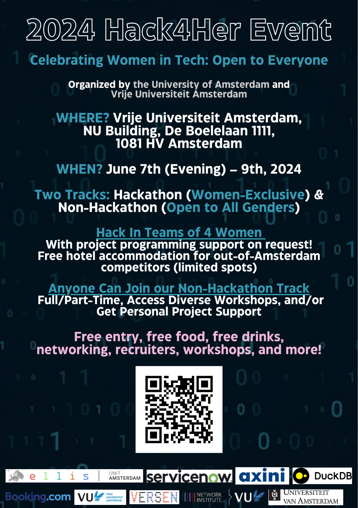

# 🌟 Welcome to the 3rd Annual Hack4Her Event June 7-9, 2024! 🌟

Join us for a weekend focused on creating a women-centric tech space, presented jointly by the University of Amsterdam (UvA) and VU Amsterdam. All students in the Netherlands are welcome to register. We offer participants two distinct tracks: the hackathon track and the non-hackathon track. While all genders are welcome to participate in the event, **only individuals who identify as women are eligible to compete in the hackathon**. If you're an academic professional in the Netherlands—whether a Ph.D. candidate, professor, or beyond—and you're interested in participating in any aspect of this event, please don't hesitate to reach out to us [here](mailto:hack4her2024@gmail.com).

## Dates & Times

- **Kickoff:** June 7th, 17:00 - 22:00
- **Full Days:** June 8th, 9:00 - 21:00 & June 9th, 9:00 - 18:00

## Location
Vrije Universiteit Amsterdam, NU Building, De Boelelaan 1111, 1081 HV Amsterdam

## What's on Offer
- **Hackathon Track:** Engage in challenges, bring ideas to life, and compete for prizes. No extensive coding experience is required. This track aims to develop problem-solving and project development skills while fostering learning. Participate in the hackathon to boost your CV with an impressive addition!  Limited free accommodation is available for hackathon participants from outside Amsterdam.
- **Non-Hackathon Track:** Choose from two options (or a combination of the two) and attend full-time or part-time:
  - **Independent Work Area:** Focus on personal projects/work with expert support. Enjoy complimentary food, drinks, and snacks for a productive weekend.
  - **Workshops and Talks:** Expand your knowledge on topics like logic synthesis, nanotechnology, AI, and diversity in tech. Receive certificates of attendance/completion for CV and LinkedIn accreditation.

## Additional Benefits for Both Tracks
- **Keynote Presentations:** Learn from industry and university leaders about technology and diversity.
- **Networking Opportunities:** Engage in networking opportunities throughout the event, including a special networking event on Friday evening. Connect with like-minded individuals, potential collaborators, academics, and industry professionals to foster meaningful connections. 
- **Free Food & Drinks:** Enjoy complimentary meals, snacks, and refreshments throughout the event.

🚀 Join us for an exciting weekend of coding, innovation, learning, networking, working, and fun at Vrije Universiteit Amsterdam! 🚀

🌟 **Sign up now, normal registration closes May 15th!** 🌟

SIGN UP WITH THIS [LINK](https://forms.gle/f2CAsBgg9r4Qn591A) OR THE QR CODE BELOW. 

## Prizes
More information coming soon ...

## Questions?
Please do not hesitate to contact us [here](mailto:hack4her2024@gmail.com) if you have any questions or comments. 

[back](./)
