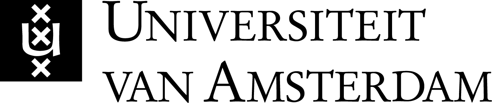

# Information
Everything you need to know about Hack4Her

## Event Details

Our 5th Annual Hack4Her event is taking place on June 12-14 2026 at the TU Eindhoven in the Auditorium builing.

More information will follow soon!

## Free travel policy 
We are committed to making the hackathon accessible and ensuring a positive experience for all participants. That's why in the past, we have refunded travel costs to Hackers coming from outside the area of the event during the hackathon days. This would not be possible without the support of the universities that the Hackers (you!) come from. To get a better chance at receiving free transport, contact your university to ask whether they would be interested in sponsoring our event!

### Eligibility Criteria
- Be eligible to participate in our hackathon
- Be signed up to participate in our hackathon
- Be present on Friday, Saturday and Sunday
- Be traveling from outside of Eindhoven to our event
- Have a travel time to Eindhoven central statuin of an hour or more (via public transport route)
- Reconfirm within a timely manner (72 hours)

### Note:
- Parking will only be covered on the TU/e campus
- Carpooling is encouraged and may include gas compensation
- Group train tickets increase your chances of receiving full compensation
- While we aim to cover as much as possible, we cannot guarantee full compensation. We will inform you promptly before the event regarding the coverage of your costs.

## Code of conduct
All participants must adhere to our [code of conduct](/assets/imagesconduct.png) throughout the event. 

## Frequently Asked Questions
I signed up via the form, is there anything else I need to do?
> Once you've completed the registration form, there are a few next steps depending on your track (Hacking & Workshops or Workshops only). You will receive an email detailing what you need to do.

I signed up via the form, and received an email that I am on the waitlist. What does that mean?
> Our sign-up procedure operates on a first-come first-served basis. If you have been waitlisted, that means there have been more sign-ups than we have spots. If another participant decides to drop out of the event, your position in the waitlist determines whether you may take their spot.

I signed up for one of the tracks, but now I would like to switch to the other one. How can I do that?
> Email us at info.hack4her.tue@gmail.com stating which track you want to switch to. Please use the same email that you signed up with.

Do I need to know how to code to participate in the hackathon portion?
> Generally not. Most of our challenges can be solved even with limited technical knowledge, though implementing your ideas in code yields extra points. The rubric for each challenge will be posted prior to the hackathon start date, so keep an eye out!

How many women can be in a team?
> Teams consist of at most 4 women, though in special cases you are allowed to compete with fewer. Note that complete teams take precedence in the waitlist over incomplete teams!

I don't have a (complete) team. Can you help me find teammates?
> Yes! When you sign up, you can specify whether you would like for us to match you with other incomplete teams. If so, we will do our best to pair you with others such that you form a complete team. Once we notify you of who you've been matched with, we suggest that you meet up at least once before the hackathon to get to know each other!

I identify as a man / I identify as non-binary. Can I still participate?
> Yes, though not as a Hacker. Only women are eligible to participate in the hackathon portion. You can participate on Friday, where we'll be hosting a bunch of cool workshops and a networking event with several companies.

I am a trans woman. Am I welcome at this event?
> Yes, both as a Hacker, and as a workshop attendee. Since the first edition of the event, our stance has always been that trans women are women. You are welcome to participate

<!--
[Photos](https://statiephotography.pixieset.com/hack4her/)

## Post-Event Summary

**Hack4Her 2024: A Celebration of Women in Tech and Innovation**

Amsterdam, June 10, 2024 — The third annual Hack4Her event successfully concluded on June 9, 2024, at Vrije Universiteit Amsterdam. Over three transformative days, Hack4Her 2024 brought together more than 100 participants, including students, professionals, and industry leaders, all united in their commitment to creating women-centered tech spaces and promoting gender diversity in technology.

**Event Overview and Impact**

Hack4Her 2024 was designed to empower women in technology through a blend of collaborative innovation, hands-on learning, and professional networking. The event provided a platform for participants to develop cutting-edge solutions, expand their technical knowledge, and forge meaningful connections with industry experts.

**Keynote Highlights**

The event featured compelling keynote speeches from professionals and academics, each addressing critical issues related to women in tech:

- **Shirley de Wit**, PhD Candidate at TU Delft, opened the event with her talk, "But Girls Just Don’t Like Tech." She explored the gender gap in computer science, discussing stereotypes, interest development, and gender-inclusive education. Her insights provided actionable strategies to attract more women to the field.
- **Ana Clara Cassanti**, Lecturer in Sustainability at Vrije Universiteit Amsterdam, delivered a session on "Diversity and Inclusion through the Lens of Identity Markers and Intersectionality." She emphasized the importance of understanding multiple identities and their impact on creating inclusive environments.
- **Viktoriya Li and Arshana Ramautar**, students at VU Amsterdam, presented "Programmed Inequality: The Story of Margaret Masterman." Their talk highlighted the significant contributions of Margaret Masterman in computational linguistics, underscoring the historical challenges faced by women in computing.

**Workshops**

Hack4Her 2024 offered an array of workshops led by industry professionals, providing participants with practical skills and knowledge on various cutting-edge topics:

- **JAX Programming** by Samuele Papa (University of Amsterdam) covered the fundamentals and advantages of JAX, a fast and flexible programming framework. Participants learned how JAX handles compilation and its functional programming framework through a hands-on example.
- **Model-Based Testing** by Machiel van der Bijl and Lou Ottens (Axini) introduced participants to next-generation test automation techniques. This workshop provided a hands-on demo of how tests are generated, not programmed, and their application in real-world scenarios.
- **Demystifying the Technical Interview** by Hilary McReynolds (Booking.com) demystified the technical interview process, offering valuable tips and strategies. Attendees gained insights into the goals of interviews, common formats, and how to approach programming tasks confidently.
- **Using Data to Build Great Products** by Aida Rikovic Tabak (ServiceNow) taught participants how to leverage usage data to enhance product development and user experience. The workshop covered methods for collecting and analyzing data, setting data-driven goals, and implementing iterative improvements based on user behavior insights.
- **Logic Synthesis for AI** by Prof. Dr. Marcel Walter (Uni Bremen, TUM) explored how to design custom FPGA accelerators for neural network inference, showing the important intersection of chip design, logic synthesis, and AI. 
- **Changing the Perspective of Cybersecurity: From the Risk Conversation to the Goals-Driven One** by Ilse Parra focused on helping participants identify their company's main business objectives, recognizing the assets supporting those objectives, understanding potential threats to these core assets, and exploring the role of board members and management in making security a competitive edge.

**Hackathon Highlights**

The centerpiece of Hack4Her 2024 was its hackathon, which featured four major challenges designed to inspire innovative solutions:

- **ServiceNow Challenge:** Teams developed applications to combat gender discrimination in the workplace using ServiceNow's platform.
- **Booking.com Challenge:** Participants created networks to enhance safety and experiences for solo women travelers.
- **DuckDB Challenge:** Teams built a community-driven app providing safe walking routes in Amsterdam using DuckDB's data processing capabilities.
- **Optiver Challenge:** Participants worked on solutions to increase women's participation in the stock market.

Winning teams received prestigious prizes, including JBL headphones, tickets to the EU Women in Tech 2024 conference, and VVV gift cards.

**Participant Testimonials:** “I've met fantastic, like-minded people, exchanged ideas, and got inspired to learn, grow, and support my fellow women in tech. And above all - I had a lot of fun.” said one participant.

**Networking and Community Building**

Hack4Her 2024 placed a strong emphasis on community and networking. Participants enjoyed multiple networking opportunities, including a special Friday evening session, which facilitated connections between attendees and industry leaders. Complimentary meals and refreshments throughout the event further enhanced the collaborative and inclusive atmosphere.

**Acknowledgments**

We extend our heartfelt thanks to our sponsors, including ELLIS unit Amsterdam, Booking.com, Versen, ServiceNow, Axini, DuckDB, Qualcomm AI Research, Optiver, Network Institute VU, Vrije Universiteit Amsterdam (VU Amsterdam), VU Amsterdam CS Department, University of Amsterdam, UvA Faculty of Science, Tilburg University, Tilburg CSAI, and UvA Grassroots Science4all. We also recognize the invaluable contributions of our volunteers and partner organizations.

## Discord
[Discord](https://discord.gg/VEZzuWx5)

## LinkedIn Badges

[Click here to find our badges linked.](https://docs.google.com/document/d/1S1LV-b7PGv1dJ7pwy_kcskG2Wv_G68ikcVEtQp-ndP8/edit?usp=sharing)  

## Dates & Times

- **Kickoff:** June 7th, 17:30 - 22:00
- **Full Days:** June 8th, 9:00 - 21:00 & June 9th, 9:00 - 18:00

## Location
Vrije Universiteit Amsterdam, NU Building, De Boelelaan 1111, 1081 HV Amsterdam

## What's on Offer
- **Hackathon Track:** Engage in challenges, bring ideas to life, and compete for prizes. 
- **Non-Hackathon Track:** Choose from two options (or a combination of the two) and attend full-time or part-time:
  - **Independent Work Area:** Focus on personal projects/work with expert support. 
  - **Workshops and Talks:** Expand your knowledge on topics like logic synthesis, nanotechnology, AI, and diversity in tech.

## Additional Benefits for Both Tracks
- **Keynote Presentations:** Learn from industry and university leaders about technology and diversity.
- **Networking Opportunities:** Engage in networking opportunities throughout the event, including a special networking event on Friday evening. 
- **Free Food & Drinks:** Enjoy complimentary meals, snacks, and refreshments throughout the event.

## Schedule
Find the full event schedule [here](/2024_schedule.html).

## Keynotes
Find information about our really cool keynotes on this [page](/2024_keynotes.html).

## Expert Sessions
Click [here](/2024_experts.html) for information on expert sessions held this year.

## Workshops
Check out this [page](/2024_workshops.html) to see our workshops offered this year.

## Hackathon
Check out this [page](/2024_challenges.html) to see our hackathon challenges and other hackathon-related information for 2024.

# Questions?
Please do not hesitate to contact us [here](mailto:hack4her2024@gmail.com) if you have any questions or comments. 

  
  
  
  
  
  
  
  
  
  
  
  
   

-->
[back](./)
