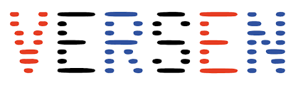

# 🌟 The 3rd Annual Hack4Her Event June 7-9, 2024🌟

# Overview

## Discord
[Discord](https://discord.gg/VEZzuWx5)

## LinkedIn Badges

[Participation (hackathon)](https://www.linkedin.com/profile/add?startTask=CERTIFICATION_NAME&name=Hacker&organizationId=103806010&issueYear=2024)

Winner (hackathon):

Attendance (non-hackathon):

## Dates & Times

- **Kickoff:** June 7th, 17:30 - 22:00
- **Full Days:** June 8th, 9:00 - 21:00 & June 9th, 9:00 - 18:00

## Location
Vrije Universiteit Amsterdam, NU Building, De Boelelaan 1111, 1081 HV Amsterdam

## What's on Offer
- **Hackathon Track:** Engage in challenges, bring ideas to life, and compete for prizes. 
- **Non-Hackathon Track:** Choose from two options (or a combination of the two) and attend full-time or part-time:
  - **Independent Work Area:** Focus on personal projects/work with expert support. 
  - **Workshops and Talks:** Expand your knowledge on topics like logic synthesis, nanotechnology, AI, and diversity in tech.

## Additional Benefits for Both Tracks
- **Keynote Presentations:** Learn from industry and university leaders about technology and diversity.
- **Networking Opportunities:** Engage in networking opportunities throughout the event, including a special networking event on Friday evening. 
- **Free Food & Drinks:** Enjoy complimentary meals, snacks, and refreshments throughout the event.

## Schedule
Find the full event schedule [here](/2024_schedule.html).

## Keynotes
Find information about our really cool keynotes on this [page](/2024_keynotes.html).

## Expert Sessions
Click [here](/2024_experts.html) for information on expert sessions held this year.

## Workshops
Check out this [page](/2024_workshops.html) to see our workshops offered this year.

## Hackathon
Check out this [page](/2024_challenges.html) to see our hackathon challenges and other hackathon-related information for 2024.

# Questions?
Please do not hesitate to contact us [here](mailto:hack4her2024@gmail.com) if you have any questions or comments. 

  
  
  
  
  
  
  
  
  
  
  
  
   

[back](./)
