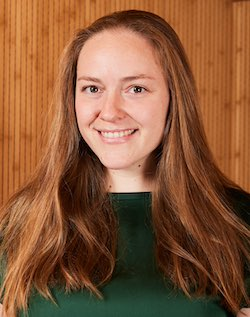
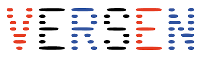
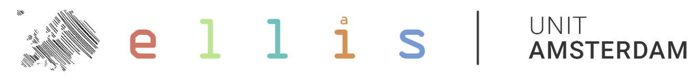
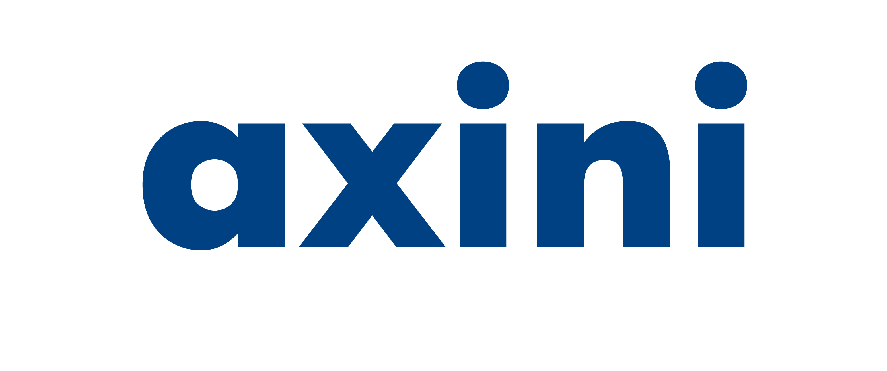
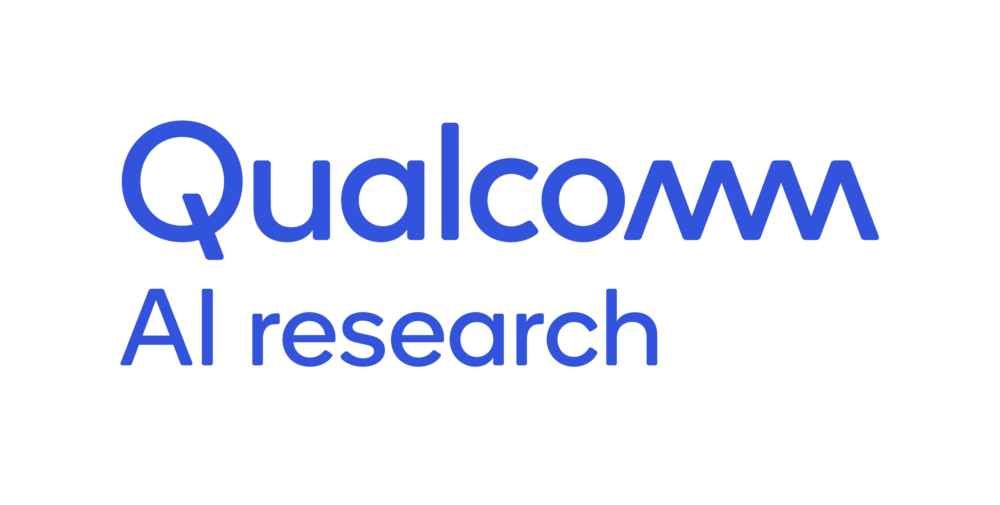
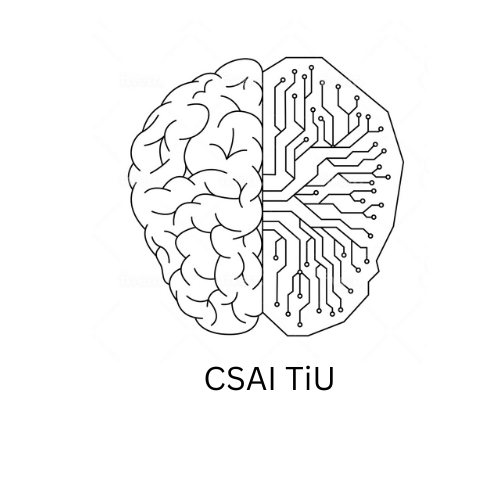

<!--
---
layout: default
---
-->
# Our Story
<!---->
The story began in October 2021, when Isabella Venancia Gardner (Bella) and Mylène Brown-Coleman founded the first Diversity Committee within the BETA student association, STORM, at VU Amsterdam. In cooperation with Dr. Katja Tuma, the idea of organizing a women-focused hackathon came as a response to encountering racist and sexist comments among classmates and identifying a lack of clear channels for reporting and seeking assistance. Hack4Her was founded to create a supportive and inclusive tech community. Its evolution reflects a commitment to these principles, with each event building upon the last to advance diversity in technology.

The first Hack4Her took place in June 2022, at VU Amsterdam. The event was women-only and attracted 35 attendees. Since then, the number of attendees kept increasing resulting in the opportunity to go national. In 2026 the first event in Eindhoven will take place.

# Meet the 2026 TU/e Team

  

    
Project Lead

    
    
Ymke Tolboom

  

  

    
Challenges Lead

    
    
Mila Ayazyan

  

  

    
Scientific Lead

    
    
<a href="https://katjatuma.github.io" target="_blank">Katja Tuma</a>

  

<!--
## Scientific Lead: [Katja Tuma](https://katjatuma.github.io/)

  
  

  
 Katja Tuma (PhD, 2021) is an Assistant Professor at Eindhoven University of Technology within the SET cluster. She obtained her Ph.D. in Computer Science and Engineering from the University of Gothenburg. She is co-founder and coordinator of Hack4Her, the national women-focused hackathon, co-founder and coordinator of the national working group on AI for security and security for AI, and co-organizer of the international workshop DeMeSSAI. Her research is at the intersection of software engineering, security and AI, and risk analysis.
 

-->

<!--
## Advisory Board: [Isabella Venancia Gardner (Bella)](https://www.linkedin.com/in/ivgardner) and [Mylène Brown-Coleman](https://www.linkedin.com/in/mylène)

## Project Lead: [Anca Strulea](https://www.linkedin.com/in/anca-strulea/)

## Public Relations Team Lead: [Lieve Jilesen](https://www.linkedin.com/in/lieve-jilesen/)

## Finance Team Lead: [Lara Popović](https://www.linkedin.com/in/lara-popovic-478806299/)

## Challenge Creation Team Lead: [Eduardo Emanuele](https://www.linkedin.com/in/caedemor/)
-->

## Scientific Committee
Our scientific committee members serve as consultants for our challenges, assist in promotion, and help ensure impartial and fair conduct of our hackathon.

### Committee Members:
* <a href="https://mengyuanzhang.github.io"> Mengyuan (Maggie) Zhang </a>, Assist. Prof. at the Vrije Universiteit Amsterdam
* <a href="https://www.uva.nl/en/profile/o/p/a.m.oprescu/a.m.oprescu.html"> Ana Oprescu </a>, Assist. Prof. at the University of Amsterdam
* <a href="http://annasperotto.org"> Anna Sperotto </a>, Associate Prof. at the University of Twente
* <a href="https://research.utwente.nl/en/persons/jan-willem-bullée"> Jan-Willem Bullée </a>, Assist. Prof. at the University of Twente
* <a href="https://research.tue.nl/en/persons/lavinia-paganini"> Lavinia Paganini </a>, Doctoral candidate at Eindhoven University of Technology
* <a href="https://www.universiteitleiden.nl/en/staffmembers/lu-cao%5B2%5D#tab-1">Lu Cao</a>, Assist. Prof. at Leiden University
* <a href="https://mairieli.com"> Mairieli Wessel </a>, Assist. Prof. at Radboud University
* <a href="https://www.tilburguniversity.edu/staff/c-guven"> Çiçek Güven </a>, Assist. Prof. at Tilburg University

<!--
## We could not exist as Hack4Her without the support of our organizations and sponsors.

  
  
  
  
  
  
  
  
  
  
  
  
   

Thank you for making this event possible! 

If you are interested in learning more about Hack4Her Sponsorship click [here](/sponsorship) or contact us [here](mailto:hack4her2024@gmail.com).

-->

