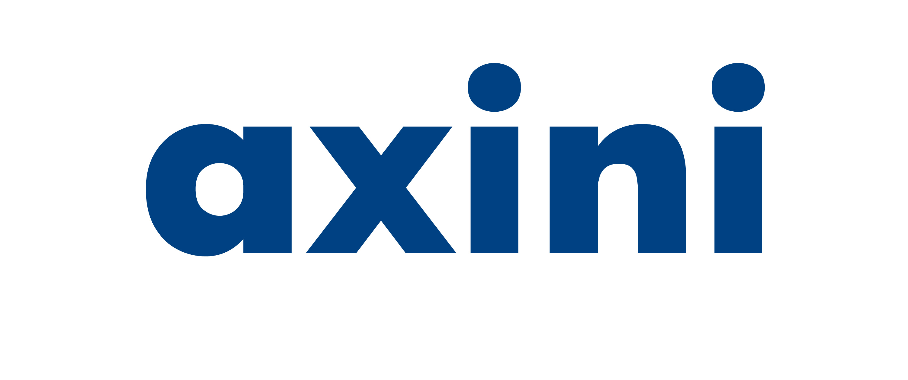
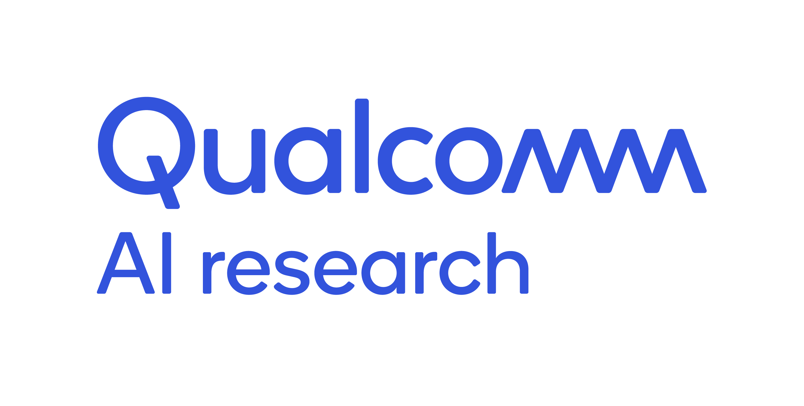
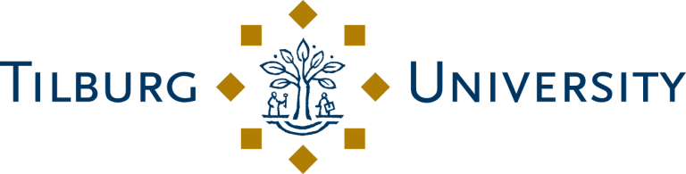

# Our History

Hack4Her originated in October 2021, established by Isabella Venancia (Bella) and Mylène Brown-Coleman. They founded the first Diversity Committee within the BETA student association, STORM, at VU Amsterdam. This initiative was in response to encountering racist and sexist comments among classmates and identifying a lack of clear channels for reporting and seeking assistance.

Bella served as the Co-founder and Chair of the Diversity Committee, with Mylène as the Vice Chair, up until their graduation. Their efforts were directed towards fostering an environment of inclusivity and respect.

The concept for Hack4Her was inspired by Mylène's observations at the Amsterdam Algorithm Programming Preliminary (AAPP) during her time as comittee secretary, where a significant underrepresentation of women was noted. Inquiry into the low participation of women revealed concerns over feeling unwelcome, and underqualified, and the discomfort of being the only female participant.

Supported by BETA faculty member Katja Tuma, the first Hack4Her hackathon took place in June 2022 at VU Amsterdam. The event was women-only and attracted 35 attendees. [Learn more about the event](/events_archive).

In 2023, the event was expanded to welcome all genders while maintaining a focus on women in tech. Held at the Booking.com office with Booking.com as the main sponsor, the participation increased to 75, with a total of 100 attendees. This iteration emphasized a broader learning and networking experience. [Learn more about the event](/events_archive).

Hack4Her was founded to create a supportive and inclusive tech community. Its evolution reflects a commitment to these principles, with each event building upon the last to advance diversity in technology.

# Our Mission

Hack4Her is dedicated to fostering a women-centered space in the technology sector. Our mission revolves around providing women with increased opportunities for hackathon participation and project experience, educating all individuals on the importance of women-centered technology and inclusivity, promoting diversity within the tech community, and facilitating connections among people from various backgrounds.

## Our Goals

1. **Champion Women in Tech**: Create a women-centered space that empowers and elevates.
2. **Expand Hackathon Horizons**: Ensure every woman has the opportunity to shine in tech competitions.
3. **Educate for Inclusivity**: Inform all individuals about the importance of women-centered technology and inclusivity.
4. **Diversify Tech**: Actively promote and celebrate diversity within the tech community.
5. **Foster Connections**: Build bridges within the tech world, connecting minds and creating opportunities.
6. **Innovate Together**: Collaborate on projects that spotlight women's contributions to technology.
7. **Empower Through Experience**: Provide real-world tech project experience to women aspiring to make their mark.
8. **Elevate Every Voice**: Ensure that every woman in tech feels heard, supported, and valued.
9. **Break Barriers**: Challenge and dismantle the obstacles facing women in technology.
10. **Cultivate Community**: Grow a supportive network where women in tech thrive together.

# Meet Our Team

## Scientific Lead: [Katja Tuma](https://www.linkedin.com/in/katjatuma)

  
  

  
Dr. Katja Tuma is an Assistant Professor at Vrije Universiteit Amsterdam, specializing in cybersecurity. Her work focuses on the intersection of security and system design, particularly in the context of cyber-physical systems. Dr. Tuma's research aims to enhance the understanding of security risks and develop strategies for resilient system design. She actively contributes to academic discourse through publications and serves on various conference committees, reflecting her commitment to advancing cybersecurity knowledge and practice. 
 

For more details, visit her [professional page](https://katjatuma.github.io/).

### Project Lead: [Isabella Venancia Gardner (Bella)](https://www.linkedin.com/in/ivgardner)

  
  

  
Isabella Venancia Gardner (Bella) is currently doing her Master’s in Artificial Intelligence at the Universiteit van Amsterdam. She graduated Cum Laude from Vrije Universiteit Amsterdam with a Bachelor’s in Artificial Intelligence, complemented by a minor in Technology Law and Ethics and completion of the Honour’s Programme. Isabella co-founded and led the first Diversity Committee within the BETA student association, STORM, at Vrije Universiteit Amsterdam, focusing on reducing discrimination and increasing diversity in CS and AI university programs. Her leadership extended to organizing Hack4Her, the inaugural women-focused hackathon at VU Amsterdam, and expanding the event in collaboration with Booking.com, fostering a community dedicated to inclusivity and innovation in technology. Her commitment to advancing diversity in tech and AI has led to notable recognitions, including being a recipient of the Studienstiftung des Deutschen Volkes scholarship, awarded for remarkable academic and social qualities, and the Qualcomm Diversity AI Fellowship 2023 from the ELLIS Foundation, supporting her Master’s studies. Beyond her academic and volunteer achievements, Bella is actively involved in teaching and mentoring roles within Vrije Universiteit Amsterdam. She is/has been a course organizer and teaching assistant for a variety of courses including but not limited to Machine Learning, Databases, and Project Conversational Agents.
 

## Advisory Board: [Mylène Brown-Coleman](https://www.linkedin.com/in/mylène)

  
  

  
Mylène Brown-Coleman is currently excelling as an AI Consultant at ServiceNow, where she crafts AI solutions to enhance business processes and operational efficiency for clients. Having recently graduated with a degree in Artificial Intelligence from Vrije Universiteit Amsterdam, her education was distinguished by her role as an Artificial Intelligence Research Intern at Gemeente Amsterdam. Here, she developed an end-to-end pipeline for Google review analysis for her thesis project. This project was part of the Amsterdam for All initiative aimed at improving accessibility for individuals with disabilities, demonstrating Mylène's ability to translate academic insights into solutions for societal challenges. Her passion for education shines through her work as an Academic and General Teaching Assistant at Vrije Universiteit Amsterdam, where she has served as a teaching assistant for courses including Data Structures & Algorithms, Computational Thinking, and Project Intelligent Systems. Her leadership qualities and commitment to social impact are evident in her founding of a diversity committee and Hack4Her, the first recurring women-centered hackathon in the Netherlands in the last five years, emphasizing her dedication to inclusivity in technology. These initiatives have significantly increased female participation in programming competitions, underlining her role as a catalyst for change within the community. Her achievements include the Generation Google Scholar, Nutanix Women Heart Technology Scholarship, AnitaB.org GHC Scholar, and notably, the Faculty of Science Student Talent Award in January 2024, which recognises her remarkable contributions to her field and community. Mylène Brown-Coleman's story is a vivid illustration of her transition from an ambitious AI student to a consultant and advocates for diversity and inclusivity in technology, reflecting not only her profound passion for AI but also her committed effort to utilize technology for the betterment of society.
 

## Scientific Committee
Our scientific committee members serve as consultants for our challenges, assist in promotion, and help ensure impartial and fair conduct of our hackathon.

### SC Members:
* <a href=""> Mengyuan (Maggie) Zhang </a>, Assist. Prof. at the Vrije Universiteit Amsterdam
* <a href="https://www.uva.nl/en/profile/o/p/a.m.oprescu/a.m.oprescu.html"> Ana Oprescu </a>, Assist. Prof. at the University of Amsterdam
* <a href="http://annasperotto.org"> Anna Sperotto </a>, Associate Prof. at the University of Twente
* <a href="https://research.utwente.nl/en/persons/jan-willem-bullée"> Jan-Willem Bullée </a>, Assist. Prof. at the University of Twente
* <a href="https://research.tue.nl/en/persons/lavinia-paganini"> Lavinia Paganini </a>, Doctoral candidate at Eindhoven University of Technology
* <a href="https://www.universiteitleiden.nl/en/staffmembers/lu-cao%5B2%5D#tab-1">Lu Cao</a>, Assist. Prof. at Leiden University
* <a href="https://mairieli.com"> Mairieli Wessel </a>, Assist. Prof. at Radboud University
* <a href="https://www.tilburguniversity.edu/staff/c-guven"> Çiçek Güven </a>, Assist. Prof. at Tilburg University

## Team and Organizational Volunteers 2024

### [Andreas Panteli](https://www.linkedin.com/in/andreas-panteli/)

<!--

  
  

  -->
  
Meet Andreas, a dedicated Digital Pathology researcher with a master's and a current doctoral position in AI for personalized Immunotherapy. Passionate about leveraging technology for healthcare improvements, he constantly pushes boundaries in the lab. His work on detecting immune cells for breast cancer research aspires to one day be used in clinics by pathologists in their daily practice. This important work keeps him motivated for new challenges and new opportunities. In the past couple of years, Andreas has extended his impact beyond research, engaging in community outreach and facilitating social collaboration. As a board member of Inclusive AI, he has led efforts for a more inclusive workplace at the University of Amsterdam. Further, he actively engages in strengthening the collaboration of fellow researchers by volunteering in the organization of conferences and the activities of the Ellis unit in Amsterdam.

 

Sharing our gratitude to our organizing team: [Lieve Jilesen](https://www.linkedin.com/in/lieve-jilesen/), [Lalith Sai Swaroop](https://www.linkedin.com/in/lalith-sai-swaroop-a5b6001a4/), [Krijn Dignum](https://www.linkedin.com/in/krijn-dignum/), [Carlos Eduardo Emanuele](https://www.linkedin.com/in/caedemor/), [Liam Levy](https://www.linkedin.com/in/liam-levy/), [Pahal Agrawal](https://www.linkedin.com/in/pahal-agrawal/), [Vlad-Andrei Cursaru](https://www.linkedin.com/in/vlad-cursaru/), [Radu Apsan](https://www.linkedin.com/in/radu-apsan/), [Varuni Sood](https://www.linkedin.com/in/varuni-sood-588193225/), [Christina Bara](https://www.linkedin.com/in/christina-bara/), [Zuva Munshi](https://www.linkedin.com/in/zuva-munshi/), [Anna Wischnewski](https://www.linkedin.com/in/anna-wischnewski/), [Women in STEM](https://www.linkedin.com/in/women-in-stem-vu/).

## We could not exist as Hack4Her without the support of our organizations and sponsors.

  
  
  
  
  
  
  
  
  
  
  
  
   

Thank you for making this event possible! 

If you are interested in learning more about Hack4Her Sponsorship click [here](/sponsorship) or contact us [here](mailto:hack4her2024@gmail.com).

[back](./)

