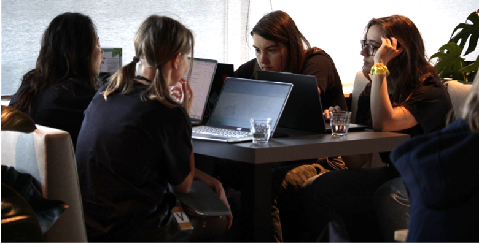
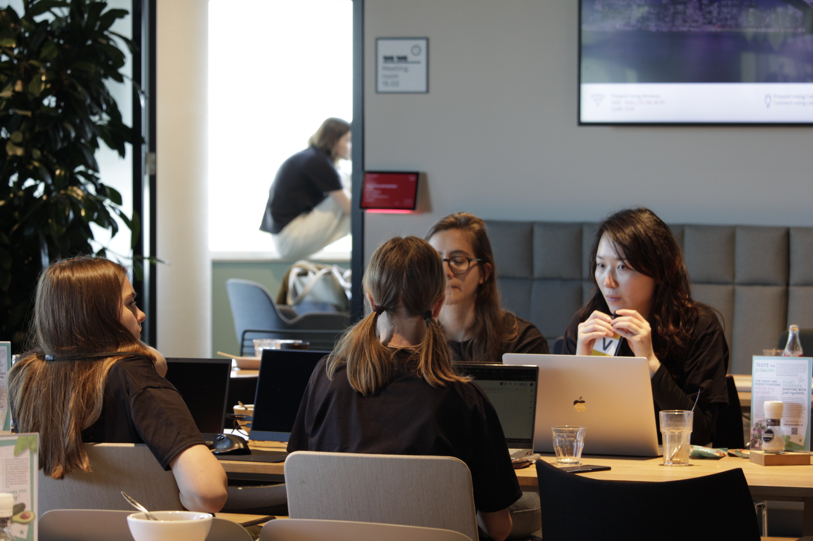
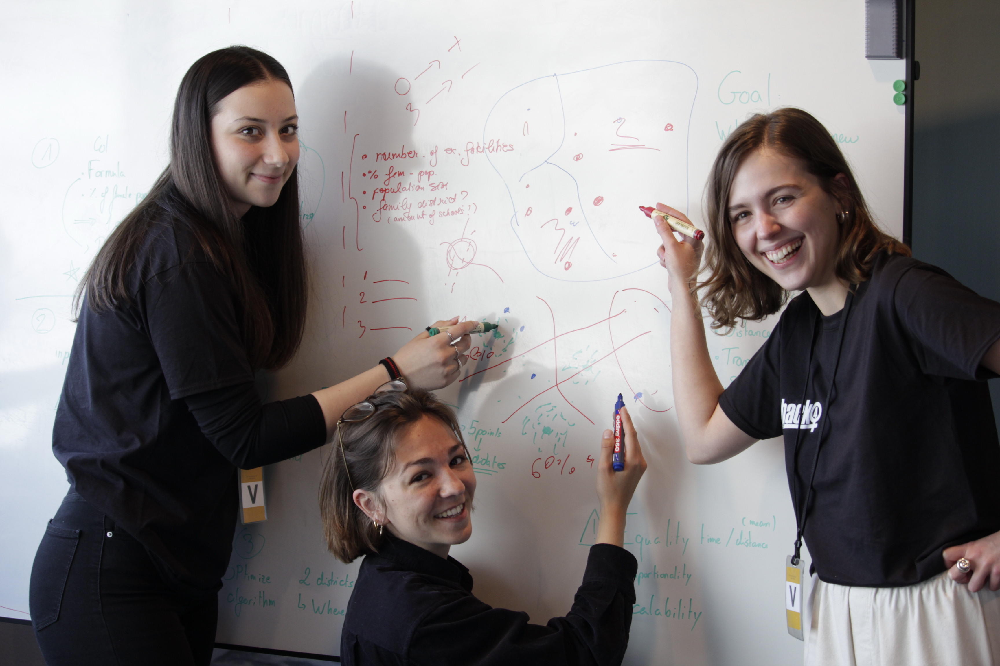
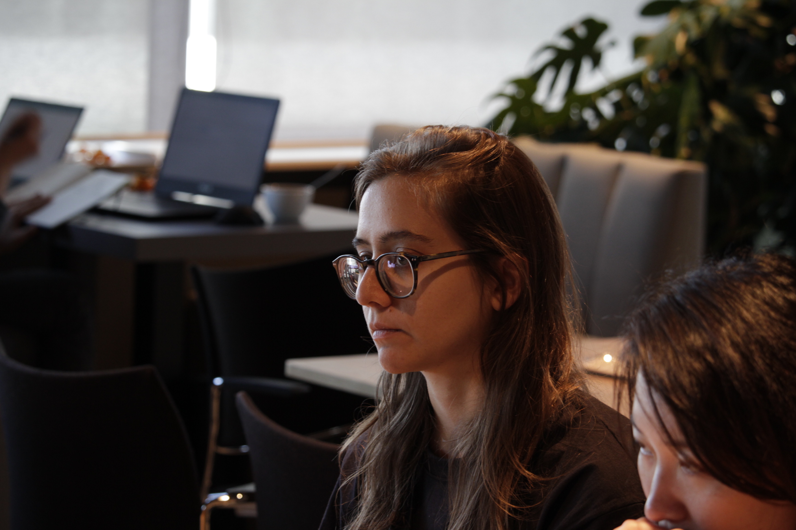
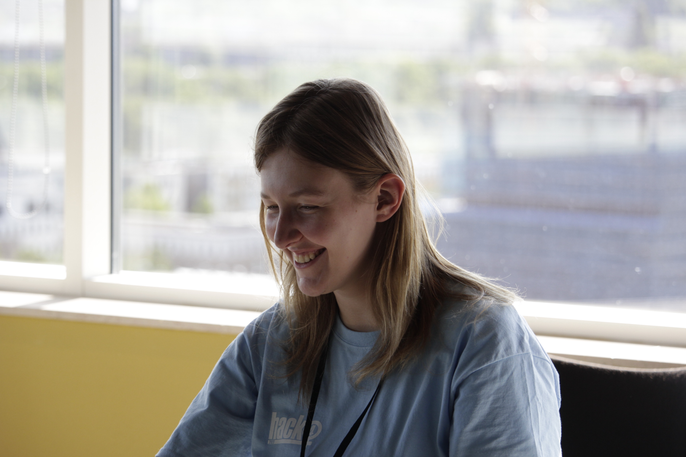
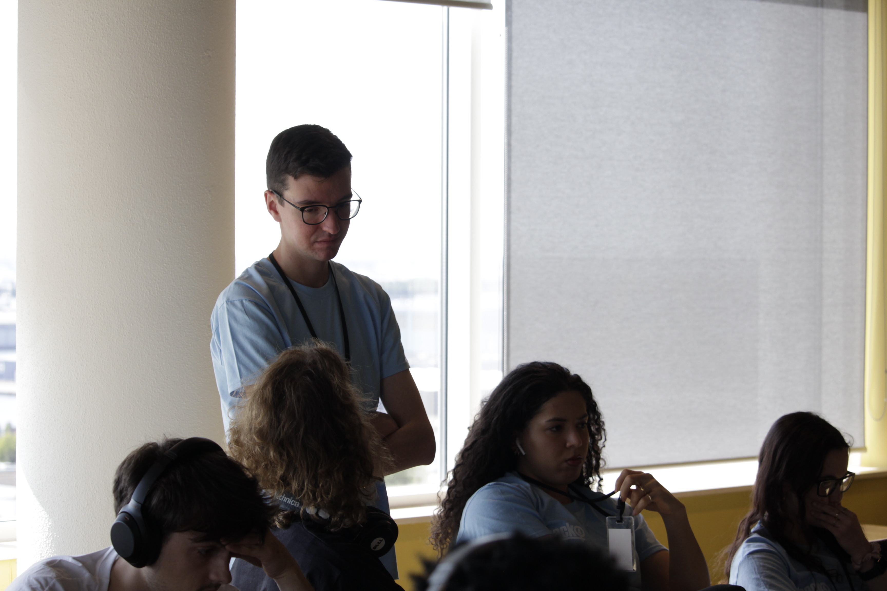

# What is Hack4Her?
Hack4Her is the _**only female-focused**_ student hackathon in the Netherlands in the past 5 years. ...

# <a id="anchor-why">Why Hack4Her is needed?</a> 
Too many female students drop out of computer science disciplines early-on which has a propagating negative effect on the proportion of women in academic positions and modern paths to wealth such pursuing high-tech careers in computer science (which started with a poor ratio [1] and had not improved [2] - see Dutch technical universities in [3]). The lack of women academics creates a negative feedback loop as it has been empirically shown that role models can push more women into the discipline [4-6].

The root of this problem lies with parenting, education system, teachers and peers which might contribute to gender stereotyped beliefs about high-tech professions [7] thus hampering girls’ and women’s later decisions about pursuing (and remaining) in high-tech careers. A mentality shift is a challenging long-term societal goal, requiring structural investments and policies, but certainly worth investing in. 

Höhne and Zander [8] found empirical evidence of female students experiencing greater uncertainty about their belonging within the domain of computer science than male students. In addition, Höhne and Zander [8] found that belonging uncertainty significantly predicted students’ dropout intentions above and beyond the pertinent predictors academic self-efficacy, expectancy of success, perceived future utility value of the subject, and previous academic performance. Therefore, short-term goals with immediate actions to improve this situation should urgently be taken by educational institutions (such as Universities) where a systematic gender gap exists.

At the Vrije Universiteit Amsterdam, we have heard from our own female students about symptoms of “not belonging”, such as stories about the uncomfortable stereotypes that are imposed in some student circles (“it’s better she writes the report, and he does the coding” and similar). This has motivated us to work together with the Student Diversity Committee and a group of student volunteers and organise a women-only student hackathon with the aim to valorize and retain the female students that are already studying at our University.

Research shows that activities such as STEM-based social groups, cliques, extramural clubs, or graduate programs foster a sense of belonging [9]. Hackathon is an event where people engage in rapid and collaborative engineering over a relatively short period of time such as 24 or 48 hours and is a great example of such an activity with strong community building effects. Since female participation in mainstream hackathons is poor (11%-28% reported in [10]) we organised a female-focused hackathon, following practices outlined by Kos [10]. 

To be more inclusive, we do not mandate the teams to deliver source code as a final product. In addition, the Student Diversity Committee has developed a code of conduct for the event that is presented on the first day which is important to ensure social safety and respect for intellectual property. We also do not collect any final deliverables and the judges assess the teams based on their presentation. Finally, we foster different ways participants can engage with the event other than just a competition (such as workshops and lectures) and allow people to leave earlier if desired.

    
<!--     
    
    
    
     -->

# We look forward to Hack4Her 2024, bigger, better, with students from all over Netherlands welcome!

