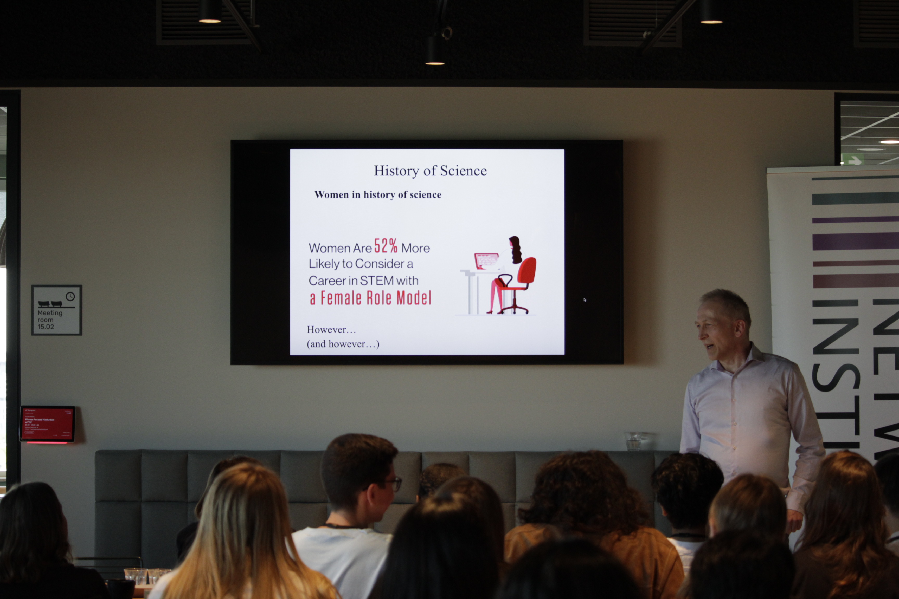

# What is Hack4Her?
Hack4Her is the _**only female-focused**_ student hackathon in the Netherlands in the past 5 years. ...

    
    
    
    
    
    

# We look forward to Hack4Her 2024, bigger, better, with students from all over Netherlands welcome!
