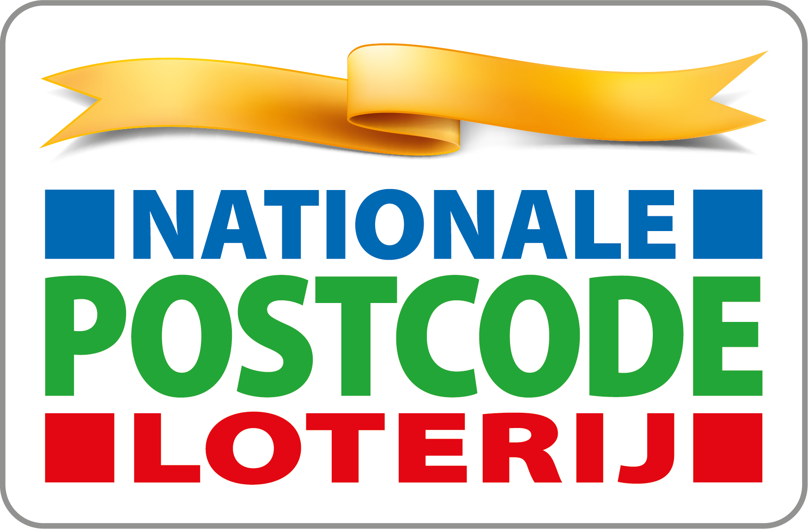

# Hack4Her has gone national: Amsterdam and Eindhoven 
Information about the event in Amsterdam is hosted on [this website](https://hack4her.org/). For the information about the event in Eindhoven, you're in the right place. More information coming soon.

## About Us
Hack4Her is the only female-focused student hackathon in the Netherlands, creating a space where technology and diversity meet. We are a coalition of staff and students from the Vrije Universiteit Amsterdam and Universiteit van Amsterdam. Our mission is simple: to create a women-centered space in the tech world. We’re dedicated to providing a welcoming atmosphere that fosters learning and innovation for all students. We aim to bridge the gender gap in technology by fostering a diverse ecosystem of students, mentors, and leaders.

<!-- Upcoming Event Highlight -->
<!--# 2024 Event
## 🌟 4th Annual Hack4Her Event 🌟
**Dates:** June 13-15, 2025 

We are planning the **4th Annual Hack4Her**, June 13-15, 2025, at VU Amsterdam and the Booking.com offices in Amsterdam Central! Join for a weekend dedicated to empowering women in tech through collaboration, innovation, and competition. Open to all students in the Netherlands, we invite you for coding, workshops, lectures, projects, and networking. While all genders are welcome, only women are eligible to compete in the hackathon portion of the event. Enjoy free food, drinks, and amazing networking opportunities! -->

<!-- ## Recent Event
### 3rd Annual Hack4Her Event
**Dates:** June 7-9, 2024  
🌟 Dive into the 3rd Annual Hack4Her, June 7-9, 2024, at VU Amsterdam! A weekend dedicated to empowering women in tech through collaboration, innovation, and competition. Open to all students in the Netherlands, we invite you to join us for coding, workshops, lectures, projects, and networking. While all genders are welcome, only women are eligible to compete in the hackathon portion of the event. Enjoy free food, drinks, and a chance for free accommodation. -->

<!-- [Learn More](/2024_event)   -->
<!-- Replace with the link to your event details page -->

<!-- News -->
# News

### Hack4Her received the 4TU Diversity Fund 2026
Hack4Her application won the 4TU.NIRICT fund to lift Hack4Her hackathon to a truly national event from 2026 onwards by bringing it to the TU/e campus and opening the participation and volunteering to 4TU students and staf

[Read more](https://www.linkedin.com/posts/4tu-nirict-netherlands-institute-for-research-on-ict_hack4her-home-activity-7397578349424054272-XI3x?utm_source=share&utm_medium=member_desktop&rcm=ACoAABPzpLQBBNIIWyJKKRvoTUXV2mgcd7r_G54)

#### Jury Report VU Amsterdam Education Awards 2023-2024 Mylène Brown-Coleman co-project lead of Hack4Her

   Vrije Universiteit Amsterdam's news release details of the jury report for the VU Amsterdam Education Awards 2023-2024, where Mylène Brown-Coleman, a bachelor’s student and co-project lead of Hack4Her, was shortlisted for the student talent award for her dedication to inclusivity and safety within the Computer Science department.
   
   [Read more](https://vu.nl/en/education/more-about/jury-report-vu-amsterdam-education-awards-2023-2024)

#### AYA RR Awards 2023: Education Quality, Hack4Her, and Inclusion - Amsterdam Young Academy
   Amsterdam Young Academy announced Dr. Katja Tuma as the recipient of the Societal Impact award at the AYA Recognition & Reward Awards for her organization of the Hack4Her hackathon, which created a safe space for women in a male-dominated field and was commended for its self-organization and impact.
   
   [Read more](https://amsterdamyoungacademy.nl/aya-rr-awards-2023-education-quality-hack4her-and-inclusion/)

#### Great Success for the Hack4Her Event - Network Institute
   The Network Institute reported on the Hack4Her event as a significant initiative highlighting the role of women in technology. The event was noted for its self-organized structure and the social, learning, and skill-practice events that took place.
   
   [Read more](https://networkinstitute.org/2023/06/20/great-success-for-the-hack4her-event/)

#### Hack4Her Shared as Best Practices for Inclusion of Women in Tech - Informatics Europe
Hack4Her entered the Minerva Informatics Equality Award and was shared as part of the Best Practices in Supporting Women in Tech by Informatics Europe.

[Read more](https://www.informatics-europe.org/index.php?option=com_content&view=article&id=321:best-practices&catid=35:minerva-informatics-equality-award)

<!-- Past Events 
## 2022,2023,2024 Events

Over 150 attendees, 50+ projects, and countless moments of innovation over our 2 years active.

"Years of empowering women in tech. See where we've been and what we've achieved." – [Our Journey So Far](/events_archive).-->

<!-- Add past event carousel of images -->

<!-- Sponsors and Partners -->
<!--
## Sponsors and Partners

We want to express our gratitude to the following sponsors for their generous support:

  
  
  
  

  

  
  
  
  
   

Thank you for making this event possible! 

If you are interested in learning more about Hack4Her Sponsorship click [here](/sponsorship) or contact us [here](mailto:hack4her2024@gmail.com).
-->
